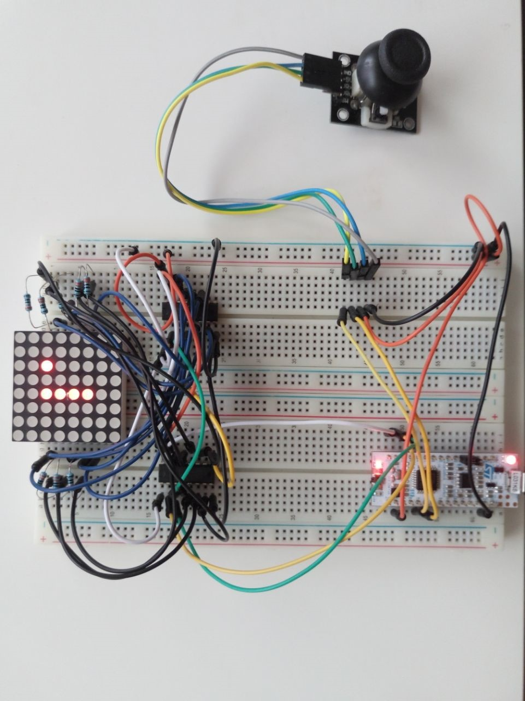

# Snake für MBed OS - STM32 Nucleo-L031K6
Bei diesem Projekt handelt es sich um eine simple Portierung des Spieleklassiker Snake auf den STM32 Nucleo-L031K6 mit MBed OS.
Dieses Projekt diente hauptsächlich dazu die Ansteuerung eines 8x8 LED Matrix Displays mithilfe von zwei Schieberegistern zu verdeutlichen.
- Die Steuerung erfolgt mithilfe eines Joysticks und die Ausgabe durch ein 8x8 LED Matrix Display.
- Eine Portierung auf andere Boards kann dank MBed OS mühelos durch die Compilereinstellungen vorgenommen werden.

## Software
- Zur Ansteuerung des Boards wird das von ARM zur Verfügung gestellte MBed OS genutzt. Dadurch ist eine Portabilität zu fast allen gängigen Boards die MBed OS Support besitzen gewährleistet.
- Die Software wurde in C++ unter dem Paradigma der objektorientierten Programmierung entwickelt.
- C++11, da MBed OS zum Zeitpunkt der Programmierung leider keine aktuellere Version unterstützt hat.

## Benötige Hardware 
- 2x Schieberegister CD74HCT4094
- 8x 330 Ohm Widerstände
- 1x 8x8 LED Matrix 1588BS
- 1x Joystick
- 1x Steckbrett mit einem Bündel an Kabeln
- 1x STM32 Nucleo-L031K6 (oder ein anderes von MBed OS unterstütztes Board) 

## Aufbau
Das 8x8 LED Matrix Display besitzt 16 Pins. Eine direkte Ansteuerung von diesem wäre daher mit den 20 digital ansteuerbaren Pins des Boards denkbar, doch sehr knapp bemessen. Dadurch könnte eine Nutzung von weiterer Periphere aufgrund von fehlenden freien Pins eingeschränkt werden. 
Eine Lösung stellt ein serielles Interface zum Microcontroller dar. Dazu könnte man sich einem Display Driver wie dem MAX6960 bedienen. Für diesen Anwendungsfall aber zu überdimensioniert, weswegen die serielle Ansteuerung mithilfe von zwei seriellen Schieberegistern realisiert wird. Als Schieberegister werden aufgrund der passenden Spezifikationen Register vom Typ CD74HCT4094 von Texas Instruments gewählt. 

Bei einer Versorgungsspannung von 3.3 V und bei einem Strom von 12 mA ergibt sich nach  R = U /I  ein benötigter Vorwiderstand von 275 Ohm für die LEDs der Matrix. Aufgrund der Verfügbarkeit werden 330 Ohm Widerstände genutzt.
Die parallelen Ausgänge der Register werden jeweils an die Zeilen- und Spaltenpins der Matrix angeschlossen. Dadurch kann ein Register die zu schreibende Zeile auswählen, während das andere Register die Zeilendaten schreibt.
Der Datenausgang des achten Bits vom ersten Schieberegister wird auf den Dateneingang vom zweiten gelegt (siehe Schaltplan). Beide Schieberegister benutzen dieselbe Takt- und Ouput-Enable-Leitung. Dadurch kann der Microcontroller die beiden 8 Bit Schieberegister wie ein einzelnes 16 Bit Register ansprechen und muss dafür nur drei Leitungen nutzen (OE, CP, Daten).  Damit hat man eine Reduktion der benötigten Pins um 81.25% erzielt. 

Der restliche Aufbau kann dem nachfolgend dargestellten Plan entnommen werden. 

## Erklärung zu den Schieberegistern
Um 16 Bit in beide Schieberegister zu speichern, wird die Funktion 'send' aus dem Quellcode genutzt. Zuerst muss verhindert werden, dass während dem Beschreiben des Registers, keine ungültigen Registerinhalte an das Display gesendet werden. Dies erreicht man durch das Deaktivieren des Output-Enable Ausgangs. Als nächstes wird die Taktleitung auf ‚0‘ gezogen. Die Daten werden an die Datenleitung übergeben und anschließend wird die Taktleitung wieder auf ‚1‘ gezogen. Mit der steigenden Takt-flanke werden die Daten vom Schieberegister übernommen. Dies passiert für alle 16 Datenbits nacheinander.
Mit der 'send' Funktion lässt sich nicht der gesamte Bildinhalt auf einmal erneuern. Im einfachsten Fall kann man sich immer eine Zeile vollständig ausgeben lassen. Alle weiteren Zeilen müssen im Multiplexverfahren (Zeilen-Multiplexing) angesprochen werden. Dazu werden die Daten des zweidimensionalen Spielfelds zeilenweise ausgelesen und nacheinander auf das Display ausgegeben. Dabei definiert das Low-Byte (y) die Zeile und das High-Byte (rowData) die Zeilendaten. Zwischen jeder Zeile werden zusätzlich 100 μs gewartet. Dieser Wert hat nach mehreren Versuchen ein gutes Ergebnis, in einer angenehmen Leuchtstärke erbracht. 

## Ergebnis
Der Prototyp wurde nach dem Schaltplan auf einem Steckbrett umgesetzt und in Betrieb genommen. 
Alle Funktionen die man vom klassischen Snake kennt, Bewegung, Essen und Sterben, funktionieren einwandfrei. Nicht so optimal, ist die Umsetzung, mit dem ganzen sichtbaren Kabelsalat ;) 

